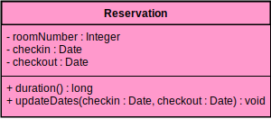
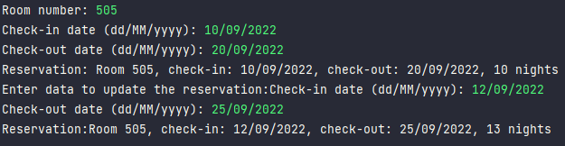
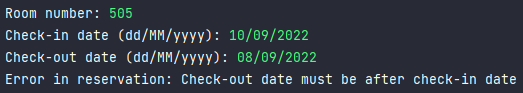
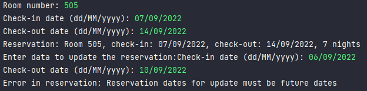

<h1 align="center">
 :sparkles:ABOUT THE PROJECT:sparkles:
</h1>

Make a program to read data from a hotel reservation and 
display the reservation data.

The program shouldn't accept reservation invalid data.

#### Rules:

- Reservation changes could happen only to future dates.
- Checkout date has to be longer then checkin date.

#### Diagram

#### Output

    

#### Exceptions output

    
    

